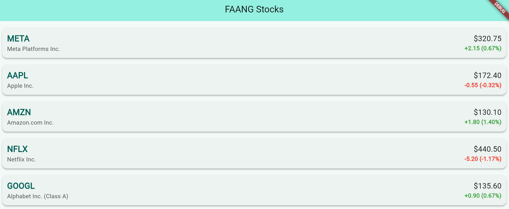

# (*Still working on a name*)

**A Flutter-based mobile and web application for tracking stock performance with a focus on beautiful visualizations and comparative analysis.**

---

## 🌟 Description

*Still working on a name* aims to provide users with an intuitive and visually appealing platform to monitor stock prices, analyze historical performance, and compare different stocks against each other or market indices. Built with Flutter, it targets both mobile (iOS & Android) and web platforms for a seamless cross-device experience.

This project is currently under active development (as of May 2025).

---

## ✨ Key Features (Planned & In Progress)

* **Real-time Stock Data:** Display up-to-date stock prices and market information.
* **Beautiful Visualizations:** Interactive and aesthetically pleasing charts (candlestick, line, area) to represent stock performance.
* **Comparative Analysis:**
    * Track a stock's performance against its own historical data over various timeframes.
    * Compare selected stocks against each other or against benchmark indices (e.g., S&P 500).
* **Watchlist:** Allow users to create and manage a personal watchlist of stocks.
* **User Accounts:** Secure login to sync watchlist and preferences across devices (mobile & web).
* **Detailed Stock View:** Access to more comprehensive information for individual stocks (e.g., volume, market cap, P/E ratio, news).
* **Responsive UI:** Adapts gracefully to different screen sizes on mobile and web.

---

## 📸 Screenshots

* Demo Onboarding Screen:

    

*  Home Screen -- Coming Soon
*  Stock Detail View with Chart -- Coming Soon
*  Comparative Analysis View -- Coming Soon

---

## 🛠️ Tech Stack

* **Framework:** [Flutter](https://flutter.dev/) 
* **Language:** [Dart](https://dart.dev/) 

* **HTTP Client:** 
* **Charting Library:** 
* **Authentication:** 
* **Database/Storage:** 
* **Stock Data API:** 

---

## 🚀 Getting Started

These instructions will get you a copy of the project up and running on your local machine for development and testing purposes.

### Prerequisites

* [Flutter SDK](https://flutter.dev/docs/get-started/install) (ensure you're on a compatible version, see Tech Stack)
* [Dart SDK](https://dart.dev/get-dart) (comes with Flutter)
* An IDE like [Visual Studio Code](https://code.visualstudio.com/) or [Android Studio](https://developer.android.com/studio)
* For mobile development:
    * Android Emulator or a physical Android device
    * iOS Simulator or a physical iOS device (requires macOS)
* API Key  

### Installation & Setup

1.  **Clone the repository (or download the source code):**
    ```bash
    git clone [https://your-repository-url.git](https://your-repository-url.git)
    cd your-project-directory-name
    ```

2.  **Install Flutter dependencies:**
    ```bash
    flutter pub get
    ```

3.  **Configure API Key:**
    * Create a file `lib/config/api_keys.dart` with the following content:*
    ```dart
    // lib/config/api_keys.dart 
    // const *** looking for a good API ***;
    ```
    

4.  **Run the app:**
    * Select your target device in your IDE.
    * Run the app using your IDE's "Run" command, or via the terminal:
        ```bash
        flutter run
        ```

---

## 🚧 Project Status

* **Current Phase:** In Development
* **Last Updated:** May 2025
* **Focus:** `(e.g., Implementing core UI, Integrating stock data API, Building charting features)`

---

## 🔮 Future Enhancements / Roadmap

*(In the process of planning still)*

* Advanced technical indicators on charts.
* Personalized news feed related to watchlist stocks.
* Price alerts and notifications.
* Theming options (dark/light mode).
* More sophisticated data caching.
* Offline access to cached data.

---


